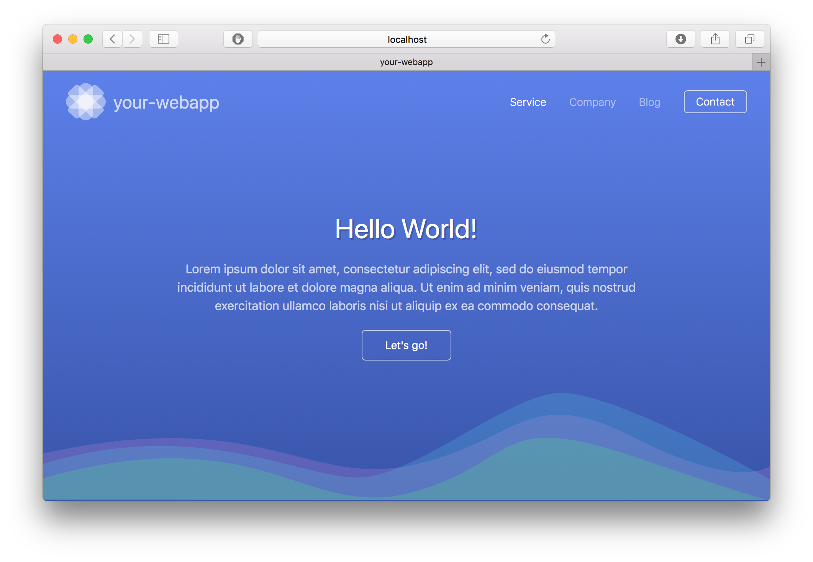

  

# generator-react-uikit-webpack-typescript 
A [yeoman](https://yeoman.io) generator that scaffolds out
a webapp based on [react](https://reactjs.org), [uikit](https://getuikit.com), [webpack](https://webpack.js.org) and [typescript](https://www.typescriptlang.org).

## Getting Started

 * Install: `npm install -g generator-react-uikit-webpack-typescript`
 * Run `yo react-uikit-webpack-typescript`
 * Run `yarn` to download npm dependencies
 * Run `yarn run build` to build the webapp into the dist directory
 * Run `yarn run start` to serve the webapp on http://localhost:8080
